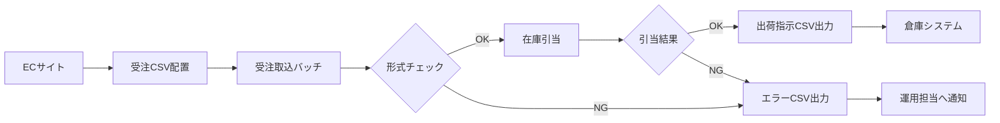

<section class="chapter">

# 概要

## 目的

本仕様書は、EC サイトから出力される受注 CSV を基幹システムへ連携するための処理仕様を定義する。対象範囲は、ファイル受信、形式検証、在庫引当、出荷指示データ作成、処理結果ファイル出力までとする。

## 対象範囲

| 区分 | 対象 | 内容 |
| --- | --- | --- |
| 入力 | 受注 CSV | EC サイトから出力される日次受注ファイル |
| 処理 | 受注取込バッチ | 入力チェック、正規化、在庫引当、結果登録 |
| 出力 | 出荷指示 CSV | 倉庫システムへ連携する出荷指示ファイル |
| 出力 | エラー CSV | 取込不可となった明細と理由 |
| 参照 | 商品マスタ | 商品コード、販売可否、温度帯 |
| 参照 | 在庫テーブル | 引当可能数、保留数 |

## システムフロー

図中の各処理の詳細は、後続の機能別仕様に記載する。

## 処理順序

1. EC サイトが受注 CSV を所定フォルダに配置する。
2. 受注取込バッチが未処理ファイルを検出する。
3. ファイル名、文字コード、ヘッダー、必須項目を検証する。
4. 商品マスタと顧客区分を参照し、内部データへ変換する。
5. 在庫テーブルを参照し、引当可能数を確認する。
6. 引当結果に応じて出荷指示 CSV またはエラー CSV を出力する。
7. 処理結果をバッチ実行履歴へ登録する。

</section>
