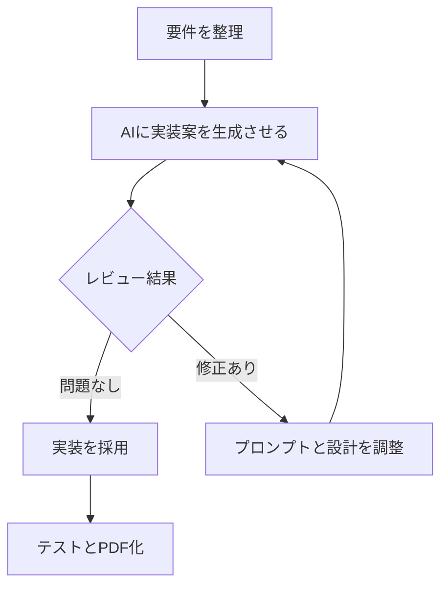
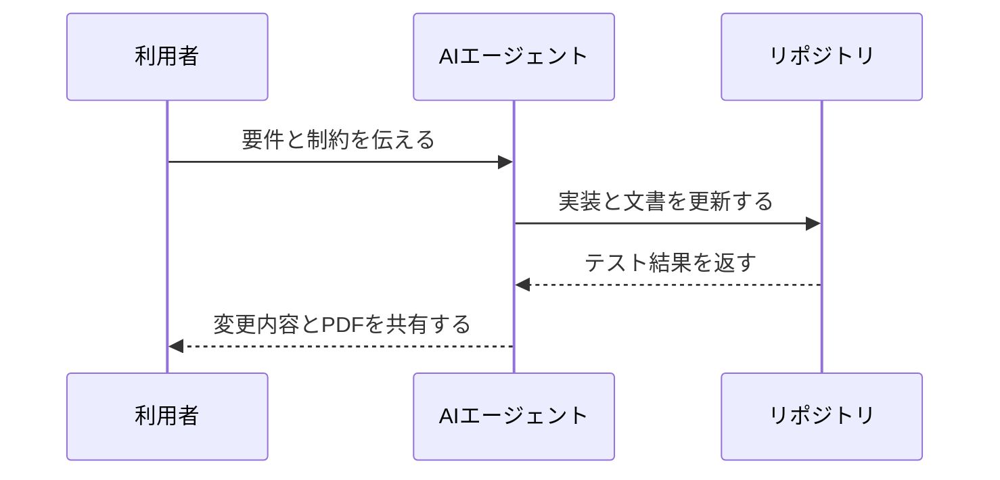

<section class="cover">

# AI駆動開発ドキュメント PDF化検証

Markdown で作成した開発ドキュメントを Vivliostyle で提出用 PDF に変換するための検証サンプル。

| 項目 | 内容 |
| --- | --- |
| 作成日 | 2026-06-30 |
| 作成者 | 開発チーム |
| 版数 | 0.1 |
| 文書種別 | 検証用サンプル |

</section>

<section class="chapter unnumbered">

# 変更履歴

| 版数 | 日付 | 変更内容 | 作成者 |
| --- | --- | --- | --- |
| 0.1 | 2026-06-30 | 初版作成。Markdown、表、コード、Mermaid、脚注、CSS の検証項目を追加。 | 開発チーム |

</section>

<section class="toc unnumbered">

# 目次

<nav>
  <ol class="toc-list">
    <li><a href="#intro"><span class="toc-number">1</span><span class="toc-title">はじめに</span></a>
      <ol>
        <li><a href="#basic-markdown"><span class="toc-number">1.1</span><span class="toc-title">基本表現</span></a></li>
      </ol>
    </li>
    <li><a href="#work-plan"><span class="toc-number">2</span><span class="toc-title">AI駆動開発の作業計画</span></a>
      <ol>
        <li><a href="#work-phase"><span class="toc-number">2.1</span><span class="toc-title">作業フェーズ</span></a></li>
        <li><a href="#wide-table"><span class="toc-number">2.2</span><span class="toc-title">長い表の確認</span></a></li>
      </ol>
    </li>
    <li><a href="#design-policy"><span class="toc-number">3</span><span class="toc-title">設計方針</span></a>
      <ol>
        <li><a href="#template-policy"><span class="toc-number">3.1</span><span class="toc-title">文書テンプレートの考え方</span></a>
          <ol>
            <li><a href="#note-section"><span class="toc-number">3.1.1</span><span class="toc-title">注意書き</span></a></li>
            <li><a href="#supplement-section"><span class="toc-number">3.1.2</span><span class="toc-title">補足</span></a></li>
          </ol>
        </li>
      </ol>
    </li>
    <li><a href="#sample-code"><span class="toc-number">4</span><span class="toc-title">サンプルコード</span></a>
      <ol>
        <li><a href="#typescript"><span class="toc-number">4.1</span><span class="toc-title">TypeScript</span></a></li>
        <li><a href="#long-code"><span class="toc-number">4.2</span><span class="toc-title">横に長いコード</span></a></li>
        <li><a href="#json-sample"><span class="toc-number">4.3</span><span class="toc-title">JSON</span></a></li>
      </ol>
    </li>
    <li><a href="#mermaid"><span class="toc-number">5</span><span class="toc-title">Mermaid 図表サンプル</span></a>
      <ol>
        <li><a href="#mermaid-direct"><span class="toc-number">5.1</span><span class="toc-title">Markdown 内に直接書く Mermaid</span></a></li>
        <li><a href="#mermaid-svg"><span class="toc-number">5.2</span><span class="toc-title">Mermaid から変換した SVG</span></a></li>
      </ol>
    </li>
    <li><a href="#test-plan"><span class="toc-number">6</span><span class="toc-title">テスト計画</span></a></li>
    <li><a href="#risks"><span class="toc-number">7</span><span class="toc-title">リスクと対策</span></a></li>
    <li><a href="#appendix"><span class="toc-number">8</span><span class="toc-title">補足資料</span></a>
      <ol>
        <li><a href="#verification-note"><span class="toc-number">8.1</span><span class="toc-title">検証メモ</span></a></li>
      </ol>
    </li>
  </ol>
</nav>

</section>

<section class="chapter">

<span id="intro"></span>

# はじめに

この文書は、AI駆動開発で日常的に作成する Markdown ドキュメントを、提出用 PDF として整形できるかを確認するためのサンプルです。要件整理、設計方針、実装計画、テスト計画、リスク管理を一つの文書に含め、Vivliostyle の基本的な組版機能を確認します。

日本語の文章、English words、`inline code`、URL https://example.com/really/long/path/that/should/wrap/properly/in/pdf/output を含め、改行や折り返しも確認します。

> AI を使う開発では、作業の過程そのものが重要な判断記録になります。Markdown を一次情報として残し、提出物として PDF 化できることは、レビューと共有の両方に役立ちます。

<span id="basic-markdown"></span>

## 基本表現

- 箇条書きの第1階層
  - ネストした項目
  - 追加の補足
- **太字**、*斜体*、`inline code`
- [内部リンク: Mermaid 図表サンプル](#mermaid)

1. 調査する
2. 設計する
3. 実装する
4. 検証する

---

</section>

<section class="chapter">

<span id="work-plan"></span>

# AI駆動開発の作業計画

<span id="work-phase"></span>

## 作業フェーズ

| フェーズ | 目的 | 成果物 | 確認観点 |
| --- | --- | --- | --- |
| 企画 | 解くべき問題を明確にする | 課題メモ、成功条件 | 目的が曖昧でないか |
| 要件整理 | 必要な機能と制約を整理する | 要件定義書 | スコープが適切か |
| 設計 | 実装前に構成を固める | 設計書、API 仕様 | レビュー可能か |
| 実装 | AI と協働してコードを作る | Pull Request | 差分が追えるか |
| 検証 | 品質を確認する | テスト結果、PDF 文書 | 再現性があるか |

<span id="wide-table"></span>

## 長い表の確認

| ID | タスク | 担当 | 優先度 | ステータス | 備考 |
| --- | --- | --- | --- | --- | --- |
| T-001 | Markdown から PDF を生成する最小構成を作る | Dev | High | Doing | Vivliostyle CLI の設定、CSS、出力先を確認する |
| T-002 | Mermaid 図を直接記述した場合の見え方を確認する | Dev | High | Todo | 直接レンダリングできない場合は、事前変換した SVG または PNG を利用する |
| T-003 | 横に長いコードブロックと URL の折り返しを確認する | Dev | Medium | Todo | 提出用 PDF では読みやすさを優先し、必要に応じてフォントサイズを調整する |

</section>

<section class="chapter">

<span id="design-policy"></span>

# 設計方針

<span id="template-policy"></span>

## 文書テンプレートの考え方

提出用 PDF では、派手な装飾よりも、読みやすさ、章立ての明確さ、表とコードの安定した表示を優先します。Markdown の記述量を増やしすぎず、CSS 側でできる限り体裁を整えます。

<span id="note-section"></span>

### 注意書き

<div class="note">

Vivliostyle の Markdown 処理だけでは Mermaid が自動描画されない可能性があります。その場合は Mermaid CLI で SVG に変換し、画像として貼り込む運用を検証します。

</div>

<span id="supplement-section"></span>

### 補足

脚注の表示も確認します。AI が生成した設計案を採用する場合は、判断理由と検証結果を残すことが重要です。[^decision-log]

[^decision-log]: 判断ログは、あとから仕様変更や不具合調査を行うときの根拠になります。

</section>

<section class="chapter">

<span id="sample-code"></span>

# サンプルコード

<span id="typescript"></span>

## TypeScript

```ts
type TaskStatus = 'todo' | 'doing' | 'done';

type DevelopmentTask = {
  id: string;
  title: string;
  status: TaskStatus;
  owner: string;
};

const tasks: DevelopmentTask[] = [
  { id: 'T-001', title: 'Create Vivliostyle config', status: 'doing', owner: 'Dev' },
  { id: 'T-002', title: 'Render Mermaid diagrams', status: 'todo', owner: 'Dev' },
];

const activeTasks = tasks.filter((task) => task.status !== 'done');
console.log(activeTasks);
```

<span id="long-code"></span>

## 横に長いコード

```sh
npm run build -- --output dist/vivliostyle-sample.pdf --theme styles/document.css --size A4 --timeout 120000
```

<span id="json-sample"></span>

## JSON

```json
{
  "documentType": "development-plan",
  "output": "pdf",
  "checks": ["markdown", "tables", "code", "images", "mermaid", "footnotes", "paged-media"]
}
```

</section>

<section class="chapter">

<span id="mermaid"></span>

# Mermaid 図表サンプル

<span id="mermaid-direct"></span>

## Markdown 内に直接書く Mermaid





<span id="mermaid-svg"></span>

## Mermaid から変換した SVG

次の図は `docs/diagrams/ai-driven-workflow.mmd` を Mermaid CLI で SVG に変換して貼り込む想定です。


</section>

<section class="chapter">

<span id="test-plan"></span>

# テスト計画

| テスト対象 | 確認内容 | 期待結果 |
| --- | --- | --- |
| ページ番号 | 本文ページに番号が表示される | フッターにページ番号が表示される |
| コード | 長い行が枠外にはみ出さない | 折り返し、または読みやすい幅に収まる |
| 表 | セル内の長文が折り返される | ページ幅内に収まる |
| Mermaid | 直接記述と画像貼り込みを比較する | どちらの運用が安定するか判断できる |
| 脚注 | ページ下部に表示される | 本文と重ならない |

</section>

<section class="chapter">

<span id="risks"></span>

# リスクと対策

| リスク | 影響 | 対策 |
| --- | --- | --- |
| Mermaid が直接描画されない | 図がコードブロックとして表示される | SVG または PNG に事前変換する |
| 日本語フォントが環境差で変わる | PDF の見た目が安定しない | フォント指定を CSS に集約する |
| 横長の表やコードがはみ出す | 提出物として読みにくい | 折り返し、フォントサイズ、表設計を調整する |
| ページ分割が不自然になる | 章や図表が読みづらい | `break-before`、`break-inside` を調整する |

</section>

<section class="chapter">

<span id="appendix"></span>

# 補足資料

<span id="verification-note"></span>

## 検証メモ

このサンプルは、PDF 出力の見た目を確認しながら改善していく前提です。最初の PDF では Mermaid の直接描画、表の幅、コードブロックの改ページを重点的に確認します。

</section>
