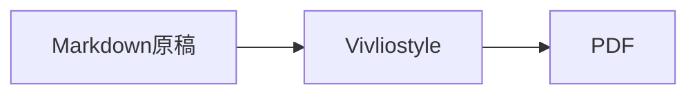

# Windows環境構築手順

Vivliostyleを使って、Markdown文書をPDF化するためのWindows向け環境構築手順です。

## 目的

この手順では、次のことができる状態を作ります。

- Markdownで文書を書く
- CSSでPDFの見た目を調整する
- VivliostyleでPDFを生成する
- Mermaidなどの図をPDFに含める

## 必要なツール

| ツール | 用途 |
| --- | --- |
| Node.js | Vivliostyle CLIを実行する |
| npm | 必要なパッケージをインストールする |
| Git | 文書や設定ファイルをバージョン管理する |
| エディタ | Markdown、CSS、設定ファイルを編集する |
| PowerShell | コマンドを実行する |

Node.jsは20以降を推奨します。

## Node.jsをインストールする

Node.js公式サイトからLTS版をインストールします。

インストール後、PowerShellで次を実行します。

```powershell
node -v
npm -v
```

バージョンが表示されれば準備完了です。

## 作業フォルダを作成する

任意の場所に文書作成用フォルダを作ります。

```powershell
mkdir vivliostyle-docs
cd vivliostyle-docs
```

## npmプロジェクトを作成する

```powershell
npm init -y
```

`package.json` が作成されます。

## Vivliostyle CLIをインストールする

```powershell
npm install --save-dev @vivliostyle/cli
```

インストール後、次で動作確認します。

```powershell
npx vivliostyle --version
```

## 基本ファイルを作成する

最小構成では、次の3種類のファイルを用意します。

```text
manuscript.md
theme.css
vivliostyle.config.js
```

### Markdown原稿

`manuscript.md` を作成します。

```markdown
# サンプル文書

これはVivliostyleでPDF化するMarkdown文書です。

## 目的

Markdownで作成した文書を、提出用PDFとして整えます。
```

### CSS

`theme.css` を作成します。

```css
@page {
  size: A4;
  margin: 22mm 18mm 20mm;

  @bottom-center {
    content: counter(page);
    font-size: 9pt;
  }
}

body {
  font-family: "Yu Gothic", "YuGothic", "Meiryo", sans-serif;
  font-size: 10.5pt;
  line-height: 1.75;
}
```

### Vivliostyle設定

`vivliostyle.config.js` を作成します。

```js
module.exports = {
  title: 'サンプル文書',
  author: '作成者',
  language: 'ja',
  size: 'A4',
  entry: ['manuscript.md'],
  theme: ['theme.css'],
  output: ['dist/sample.pdf'],
  workspaceDir: '.vivliostyle',
};
```

## PDFを生成する

次のコマンドは、`vivliostyle.config.js` や `package.json` が置かれている文書プロジェクトのルートディレクトリで実行します。

```powershell
npx vivliostyle build
```

成功すると、`dist/sample.pdf` が生成されます。

## npm scriptを追加する

毎回 `npx vivliostyle build` と入力しなくてよいように、`package.json` にscriptを追加します。

```json
{
  "scripts": {
    "build": "vivliostyle build",
    "preview": "vivliostyle preview"
  }
}
```

以後は次のコマンドでPDFを生成できます。

```powershell
npm run build
```

プレビューする場合は次を使います。

```powershell
npm run preview
```

## Mermaidを使う場合

Markdown内のMermaid記法をPDFへ安定して入れるには、事前にSVGへ変換してから埋め込む方法を推奨します。

Mermaid CLIをインストールします。

```powershell
npm install --save-dev @mermaid-js/mermaid-cli
```

Mermaidファイルを作成します。

```text
diagram.mmd
```



SVGへ変換します。

```powershell
npx mmdc -i diagram.mmd -o diagram.svg -b transparent
```

MarkdownからはSVGを画像として参照します。

```markdown

```

## Windowsでの文字化け対策

日本語を含むMermaid図を変換する場合、PowerShellやコマンドプロンプトの文字コードの影響を受けることがあります。

文字化けする場合は、変換前に次を実行します。

```powershell
chcp 65001
```

## よくある問題

### PDFが生成されない

まず、Vivliostyle CLIが実行できるか確認します。

```powershell
npx vivliostyle --version
```

次に、設定ファイルの `entry`、`theme`、`output` のパスが正しいか確認します。

### 日本語フォントが想定と違う

CSSの `font-family` を確認します。
Windowsでは、まず次のようなフォントを指定すると扱いやすいです。

```css
body {
  font-family: "Yu Gothic", "YuGothic", "Meiryo", sans-serif;
}
```

### Mermaid図が表示されない

Markdownに直接Mermaidコードブロックを書いた場合、環境によってはそのままコードとして表示されることがあります。
提出用PDFでは、SVGに変換して画像として埋め込む運用を推奨します。

### レイアウトが崩れる

VivliostyleではCSSで紙面を制御します。
余白、フォントサイズ、改ページ、画像幅、表の幅を順に確認してください。
