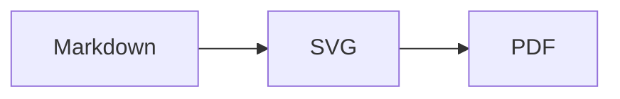

# 作成・更新手順

VivliostyleでPDF文書を作成・更新するための基本的な進め方です。

## 基本方針

Vivliostyleで文書を作る場合は、次の考え方にすると運用しやすくなります。

| 種類 | 役割 |
| --- | --- |
| Markdown | 文書の内容 |
| CSS | 文書の見た目 |
| 設定ファイル | PDF化の入力、出力、ページサイズ |
| PDF | 提出・共有用の成果物 |

PDFは直接編集しません。
内容を変える場合はMarkdownを、見た目を変える場合はCSSを編集し、PDFを再生成します。

## 新しい文書を作る

### 1. 文書の目的を決める

最初に、PDFの用途を決めます。

- 社内共有資料
- 顧客提出資料
- 機能仕様書
- 設計書
- 操作マニュアル
- 提案資料
- スライド資料

用途によって、ページサイズ、余白、見出しの粒度、図表の量が変わります。

### 2. Markdown原稿を書く

まずは見た目を気にしすぎず、Markdownで構成を書きます。

```markdown
# タイトル

## はじめに

## 全体概要

## 詳細仕様

## 補足
```

見出しは、そのまま目次や章番号の材料になります。
あとからPDF化しやすいように、見出し階層を揃えておきます。

### 3. CSSを用意する

文書用CSSでは、まず次を決めます。

- ページサイズ
- 余白
- フォント
- 行間
- 見出し
- ページ番号
- 表とコードの見た目

最初から細かく作り込みすぎず、PDFを確認しながら調整します。

### 4. Vivliostyle設定を用意する

MarkdownとCSSを指定します。

```js
module.exports = {
  title: '文書タイトル',
  author: '作成者',
  language: 'ja',
  size: 'A4',
  entry: ['manuscript.md'],
  theme: ['theme.css'],
  output: ['dist/document.pdf'],
  workspaceDir: '.vivliostyle',
};
```

### 5. PDFを生成する

次のコマンドは、`vivliostyle.config.js` や `package.json` が置かれている文書プロジェクトのルートディレクトリで実行します。

```powershell
npx vivliostyle build
```

または、npm scriptを用意している場合は次を使います。

```powershell
npm run build
```

## Markdownを書くときのポイント

### 見出し

見出し階層は、文書構造として自然な深さにします。

```markdown
# 章

## 節

### 項

#### 詳細
```

深くなりすぎる場合は、章や節を分け直します。
一般的な仕様書やマニュアルでは、4階層程度までに抑えると読みやすくなります。

### 箇条書き

短い要点は箇条書きにします。

```markdown
- 差分管理しやすい
- AIが読み書きしやすい
- PDFとして提出できる
```

### 表

項目定義や比較には表を使います。

```markdown
| 項目 | 内容 | 備考 |
| --- | --- | --- |
| ID | 一意な識別子 | 必須 |
| 名前 | 表示名 | 100文字以内 |
```

列が多すぎる表はPDF上で読みにくくなります。
必要に応じて表を分割するか、説明を本文へ移します。

### コードブロック

設定例やJSON例はコードブロックにします。

````markdown
```json
{
  "name": "sample"
}
```
````

コードが長い場合は、CSSで折り返しを指定します。

```css
pre {
  white-space: pre-wrap;
  overflow-wrap: anywhere;
}
```

## 目次を作る

Vivliostyleでは、CSSの `target-counter()` を使って、リンク先のページ番号を目次に表示できます。

例:

```html
<nav class="toc">
  <ol>
    <li><a href="#intro">はじめに</a></li>
    <li><a href="#overview">概要</a></li>
  </ol>
</nav>

<h1 id="intro">はじめに</h1>
<h1 id="overview">概要</h1>
```

```css
.toc a::after {
  content: leader(".") target-counter(attr(href), page);
}
```

複数Markdownを結合する運用では、スクリプトで見出しにIDを付与し、目次を自動生成すると安定します。

## 章番号を付ける

CSSカウンターを使うと、章番号や節番号を自動で付けられます。

```css
body {
  counter-reset: chapter;
}

h1 {
  counter-increment: chapter;
  counter-reset: section;
}

h1::before {
  content: counter(chapter) " ";
}

h2 {
  counter-increment: section;
}

h2::before {
  content: counter(chapter) "." counter(section) " ";
}
```

見出し本文に手で番号を書かず、CSSで付けると更新時に番号ずれが起きにくくなります。

## Mermaid図を入れる

提出用PDFでは、MermaidをSVGへ変換してから埋め込む方法を推奨します。

### 1. Mermaidを書く



### 2. SVGへ変換する

```powershell
npx mmdc -i diagram.mmd -o diagram.svg -b transparent
```

### 3. Markdownから参照する

```markdown

```

原稿としてMermaidを残したい場合は、ビルド前処理でMermaidコードブロックをSVGへ変換し、PDF用のMarkdownだけ画像参照に置き換える方式にします。

## CSSを更新する

### ページ設定

```css
@page {
  size: A4;
  margin: 22mm 18mm 20mm;
}
```

スライドPDFの場合は、16:9のような横長サイズも指定できます。

```css
@page {
  size: 13.333in 7.5in;
  margin: 0;
}
```

### ページ番号

```css
@page {
  @bottom-center {
    content: counter(page);
  }
}
```

表紙にページ番号を出したくない場合は、先頭ページだけ上書きします。

```css
@page :first {
  @bottom-center {
    content: "";
  }
}
```

### 改ページ

章ごとに改ページする場合は、見出しや章コンテナに指定します。

```css
.chapter {
  break-before: page;
}

h1 {
  break-after: avoid;
}
```

表や図が途中で分断されないようにする場合は、次を指定します。

```css
table,
figure,
img {
  break-inside: avoid;
}
```

## 更新時の流れ

文書を更新するときは、次の順番にすると安定します。

1. Markdownを編集する
2. 必要なら図や表を更新する
3. CSSを変更した場合は見た目の影響範囲を確認する
4. PDFを再生成する
5. PDFを目視確認する
6. Markdown、CSS、設定ファイル、PDFの差分を確認する

## 確認観点

PDF生成後は、次を確認します。

| 観点 | 確認内容 |
| --- | --- |
| 表紙 | タイトル、日付、著者が正しいか |
| 目次 | 見出しとページ番号が合っているか |
| 章番号 | 番号が飛んでいないか |
| 改ページ | 不自然な空白や分断がないか |
| 表 | 横幅に収まっているか |
| 図 | つぶれていないか、読めるか |
| コード | 折り返しや文字サイズが適切か |
| ページ番号 | 表示位置と開始位置が適切か |

## AIに更新を依頼するときのポイント

AIに文書更新を依頼する場合は、次を明確にします。

- どの文書を更新するか
- どの章や節を対象にするか
- 内容だけ変えるのか、見た目も変えるのか
- 図や表も更新するのか
- PDF生成まで行うのか

依頼例:

```text
この仕様書に新しいエクスポート機能を追加したい。
Markdown原稿を更新し、必要ならMermaid図も直して、
最後にVivliostyleでPDFを再生成して。
```
